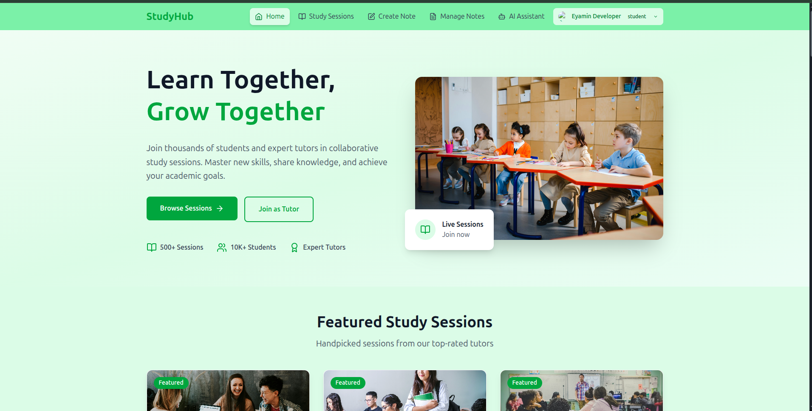
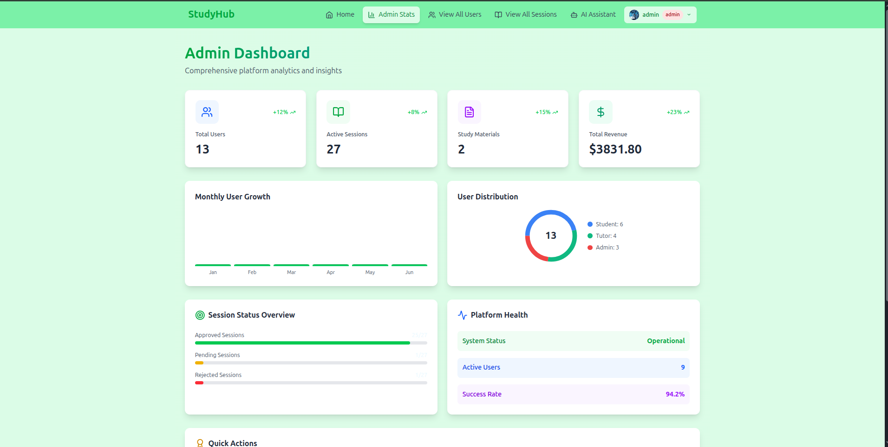

# StudyHub - Collaborative Study Platform

## 🎓 Modern Educational Platform for Collaborative Learning

A comprehensive React-based web application that connects students and tutors for collaborative study sessions, featuring real-time session management, secure payments, interactive learning materials, and AI-powered assistance.

## 🔗 Live Site URL
```
https://resilient-vacherin-ecfaf3.netlify.app/
```

## 👨💼 Admin Credentials
- **Email**: admin@gmail.com
- **Password**: "Admin 2004"

## � Screenshots

### Student Home Page


### Admin Dashboard


## �🚀 Quick Start
```bash
# Clone the repository
git clone <repository-url>

# Install dependencies
npm install

# Start development server
npm run dev

# Build for production
npm run build
```

## 🌟 Website Characteristics

• **Multi-Role Authentication System** - Secure login for Students, Tutors, and Admins with Firebase & JWT
• **Interactive Study Sessions** - Browse, book, and manage collaborative study sessions with real-time status updates
• **Secure Payment Integration** - Stripe-powered payment system for session bookings with authentication protection
• **AI-Powered Assistant** - Integrated DeepSeek AI chatbot for educational guidance and platform support
• **Comprehensive Admin Dashboard** - Complete platform management with user roles, session approval, and analytics
• **Tutor Management Portal** - Create sessions, upload materials, view bookings, and handle rejections with feedback
• **Student Learning Hub** - Access booked sessions, view study materials, create notes, and track progress
• **Responsive Design Excellence** - Fully optimized for mobile, tablet, and desktop with beautiful animations
• **Advanced Pagination System** - Efficient data loading with pagination on sessions and user management
• **Material Management System** - Upload, view, and organize study materials with Google Drive integration
• **Real-time Feedback System** - Session rejection with detailed feedback and resubmission capabilities
• **Modern UI/UX Design** - Framer Motion animations, React Icons, and Tailwind CSS styling
• **Protected Routes & Security** - Role-based access control and authentication-protected payment flows
• **Mobile-First Navigation** - Bottom navigation bar for seamless mobile experience

## 🛠️ Technology Stack

### Frontend
- **Framework**: React 19 with Vite 7
- **Styling**: Tailwind CSS 4 + DaisyUI 5
- **Animations**: Framer Motion 12
- **Icons**: Lucide React + React Icons 5
- **Routing**: React Router DOM 7
- **State Management**: Context API
- **Authentication**: Firebase Auth 12 + JWT

### Backend Integration
- **API Client**: Fetch API
- **Payment**: Stripe Elements 4
- **AI Assistant**: OpenRouter API with DeepSeek R1 Model
- **File Storage**: Google Drive API
- **Real-time Updates**: RESTful APIs
- **Database**: Firebase Firestore

## 🤖 AI Assistant Features

- **Intelligent Chatbot**: Powered by DeepSeek R1 model via OpenRouter API
- **Educational Context**: Specialized knowledge about StudyHub platform features
- **Real-time Responses**: Instant AI-generated answers to user queries
- **Voice & Image Support**: Voice recording and image upload capabilities
- **Quick Actions**: Pre-defined buttons for common questions
- **Mobile Optimized**: Responsive design with touch-friendly interface
- **Study Guidance**: Personalized study tips and educational advice

## 🎨 Design Features

- **Responsive Layout**: Mobile-first design with breakpoint optimization
- **Interactive Animations**: Smooth transitions and hover effects
- **Modern Color Scheme**: Green-based theme with professional gradients
- **Intuitive Navigation**: Icon-based navigation with active state indicators
- **Loading States**: Skeleton loaders and spinner animations
- **Error Handling**: User-friendly error messages and fallbacks

## 📱 Responsive Breakpoints

- **Mobile**: < 768px (Hamburger menu, stacked layout)
- **Tablet**: 768px - 1024px (Icon navigation, optimized spacing)
- **Desktop**: 1024px+ (Full navigation, expanded content)
- **Large Desktop**: 1280px+ (Maximum content width, enhanced spacing)

## 🔐 User Roles & Permissions

### 👨🎓 Student
- Browse and search study sessions
- Book sessions with secure payment
- Access study materials for booked sessions
- Create and manage personal notes
- View booking history and session details
- Chat with AI Assistant for study guidance

### 👨🏫 Tutor
- Create and manage study sessions
- Upload study materials and resources
- View session bookings and student lists
- Handle session updates and modifications
- Receive and respond to admin feedback
- Use AI Assistant for tutoring tips

### 👨💼 Admin
- Approve/reject study sessions with feedback
- Manage user roles and permissions
- View platform analytics and statistics
- Monitor all sessions and materials
- Handle user management and moderation
- Access AI Assistant for platform management

## 🚀 Key Features

### Authentication & Security
- Firebase Authentication integration
- JWT token management
- Protected routes and components
- Role-based access control
- Secure payment processing

### Session Management
- Create, edit, and delete study sessions
- Real-time session status updates
- Session approval workflow
- Booking system with payment integration
- Session materials and resources

### Payment System
- Stripe payment integration
- Secure checkout process
- Payment history and receipts
- Authentication-protected payments
- Booking confirmation system

### AI Assistant
- DeepSeek R1 model integration
- Educational context awareness
- Voice and image input support
- Real-time chat interface
- Study tips and guidance

### Admin Dashboard
- User management with role updates
- Session approval/rejection system
- Platform statistics and analytics
- Material moderation tools
- Comprehensive admin controls

## 📁 Project Structure

```
CollaborativeStudyPlatform/
├── src/
│   ├── Component/           # Shared components
│   │   ├── Navbar.jsx      # Responsive navigation
│   │   ├── Footer.jsx      # Site footer
│   │   ├── BottomNav.jsx   # Mobile navigation
│   │   └── ProtectedRoute.jsx
│   ├── Page/               # Main pages
│   │   ├── Authentication/ # Login/Register
│   │   ├── Dashboard/      # Role-based dashboards
│   │   │   ├── Admin/     # Admin management
│   │   │   ├── Tutor Dashboard/ # Tutor tools
│   │   │   └── Student Dashboard/ # Student portal
│   │   ├── Home Page/     # Landing and sessions
│   │   ├── Ai-Assistant/  # AI Chatbot interface
│   │   └── PaymentPage.jsx # Stripe integration
│   ├── providers/         # Context providers
│   ├── MainRout/          # Route configurations
│   ├── Firbas/           # Firebase config
│   └── main.jsx         # App entry point
├── public/              # Static assets
├── package.json        # Dependencies
└── README.md          # This file
```

## 🌐 API Integration

The frontend integrates with the StudyHub backend server for:
- User authentication and management
- Study session CRUD operations
- Payment processing
- Material upload and retrieval
- Admin dashboard functionality
- AI chatbot responses

## 📱 Mobile Optimization

- Touch-friendly interface design
- Optimized navigation for mobile devices
- Responsive image and content scaling
- Mobile-specific user experience enhancements
- Progressive Web App (PWA) ready

## 🎯 Performance Features

- Lazy loading for optimal performance
- Image optimization and compression
- Code splitting and bundle optimization
- Efficient state management
- Minimal re-renders with React optimization

## 🚀 Deployment

The application is deployed and optimized for:
- **Netlify** - Live production deployment
- **Environment Variables** - Properly configured for production
- **Build Optimization** - Vite build system for optimal performance
- **Mobile Responsive** - PWA-ready with mobile navigation

## 📄 License

This project is licensed under the MIT License - see the LICENSE file for details.

## 🙏 Acknowledgments

- Firebase for authentication services
- Stripe for payment processing
- OpenRouter & DeepSeek for AI capabilities
- Tailwind CSS for styling framework
- Framer Motion for animations
- React community for excellent documentation
